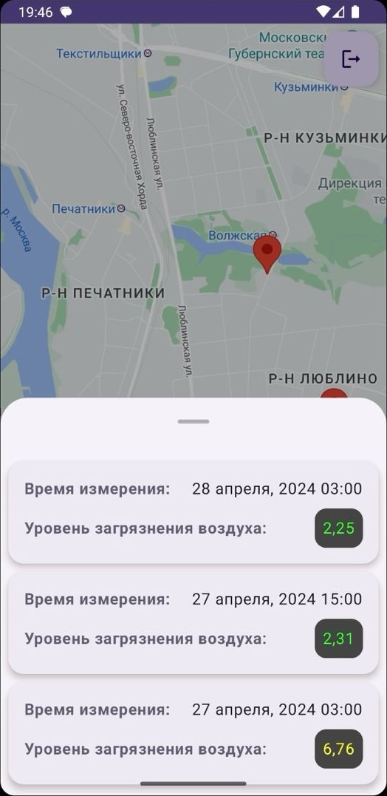

# Приложение отображения загрязненности воздуха на картах

Это мобильное приложение позволяет отображать уровень загрязненности воздуха на картах Google в различных районах. Пользователи могут просматривать информацию о качестве воздуха и мониторить изменения в разных местах.

## Стек технологий

- **Jetpack Compose**: Используется для построения пользовательского интерфейса современным и декларативным способом.
- **Firebase**: Используется для авторизации и для хранения данных о загрязнении воздуха и обмена информацией между клиентским приложением и сервером.
- **Google Maps Kit**: Используется для отображения мест измерений в виде меток на карте.

## Скриншоты
  

## Запуск приложения

Для запуска приложения необходимо в папке `values` проекта добавить файл `google_maps_api.xml` со следующим содержанием:

```xml
<resources>
    <string name="google_maps_key" translatable="false">ВАШ_API_КЛЮЧ</string>
</resources>
```
